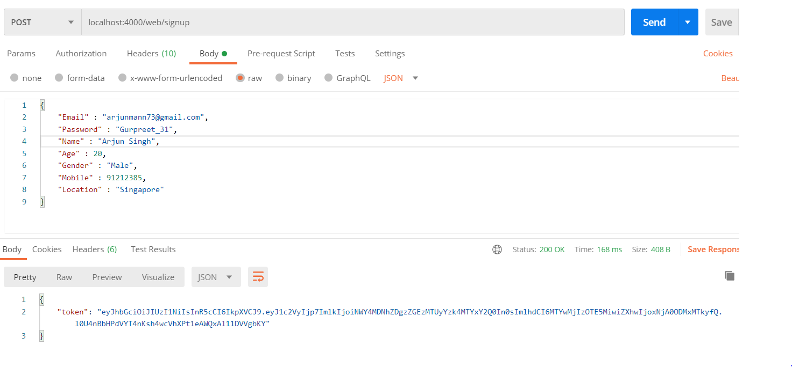
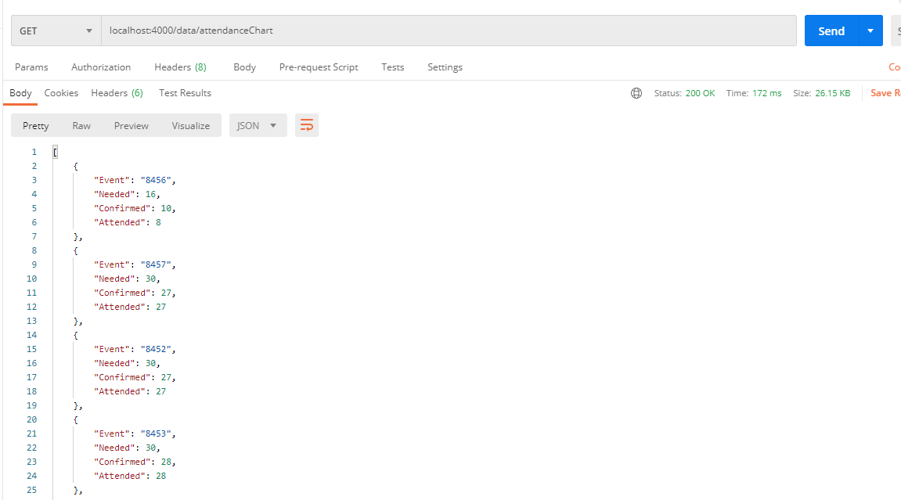
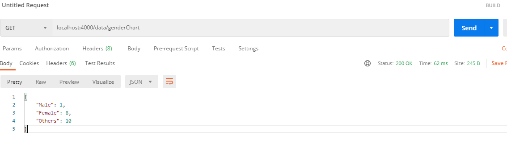
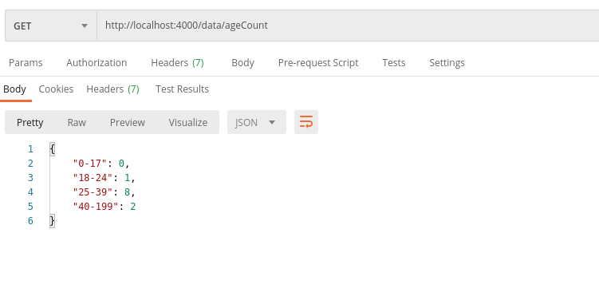
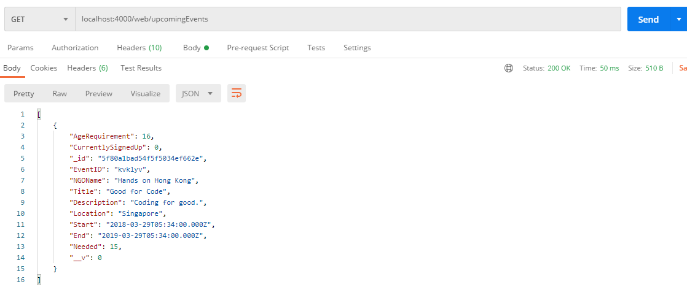

## Team 13 - SoftwareHeroes

## 1. /web/signup
 On successfull signup, JWT (java web token) is returned which is used as a header in all other API calls. The parameters are: Email, Password, Name, Age, Gender, Mobile, Location

## 2. /web/login
###  2.1. Authentication
 On valid credentials (email and password), a JWT is returned. 
 
###  2.2. Invalid credentials
 On invalid credentials, JWT is not returned and an error message is returned. 
 
 
 
## 3. /data/typeChart
 Just plot it with all of this data, dont mind the weird column names, its because of the mock data.
Return Type:
```javascript
{
    "Integrated": 167,
    "Hunger & homelessness": 146,
    "Environmental education": 14,
    "Children and youth": 13,
    "Hungers and homeless": 14,
    "Elderly": 77,
    "People with mental illness": 1,
    "Refugees and asylum seekers": 1,
    "Other": 1,
    "Animals": 43,
    "Women": 2
}
```

## 4. /data/attendanceChart
 Data is returned as JSON, refer to the picture and text below. (Image is outdated, numbers are replaced by last 4 digits of the OccurenceID)
```javascript
{
    "6866": {
        "Needed": 200,
        "Confirmed": 2,
        "Attended": 0
    },
    "6868": {
        "Needed": 50,
        "Confirmed": 0,
        "Attended": 0
    },
    "6870": {
        "Needed": 20,
        "Confirmed": 0,
        "Attended": 0
    },
    "6871": {
        "Needed": 20,
        "Confirmed": 15,
        "Attended": 0
    },
    "6881": {
        "Needed": 3,
        "Confirmed": 0,
        "Attended": 0
    },
    .
    .
    .
```

## 5. /data/genderChart
 Returned data is as follows.
```javascript
{
    "Male": 1,
    "Female": 8,
    "Others": 10
}
```

## 6. /data/ageCount
 Returned data is as follows.
```javascript
{
    "0-17": 0,
    "18-24": 1,
    "25-39": 8,
    "40-199": 2
}
```


## 7. /web/NGOsignup
 Parameters are the ones defined by Javier at the slack channel. Returns a JWT on successful authentication.

## 8. /web/NGOlogin
 Just requires the email and password, returns a JWT on successful authentication. 

## 9. /web/createOpening
 Requires a bunch of parameters stated below. Requires JWT for authentication, add JWT from signup/login to the headers and name it 'token'. Parameters:
```javascript
        Title,
        Description,
        Location,
        Start,
        End,
        Needed,
        AgeRequirement (optional)
```

## 10. /web/upcomingEvents
 Array of json objects with all details of all registered events.

## 11. /web/allVolunteers 
 Array of json objects with all details of all registered volunteers.

## 12. /web/allNGOs 
 Array of json objects with all details of all registered NGOs.

